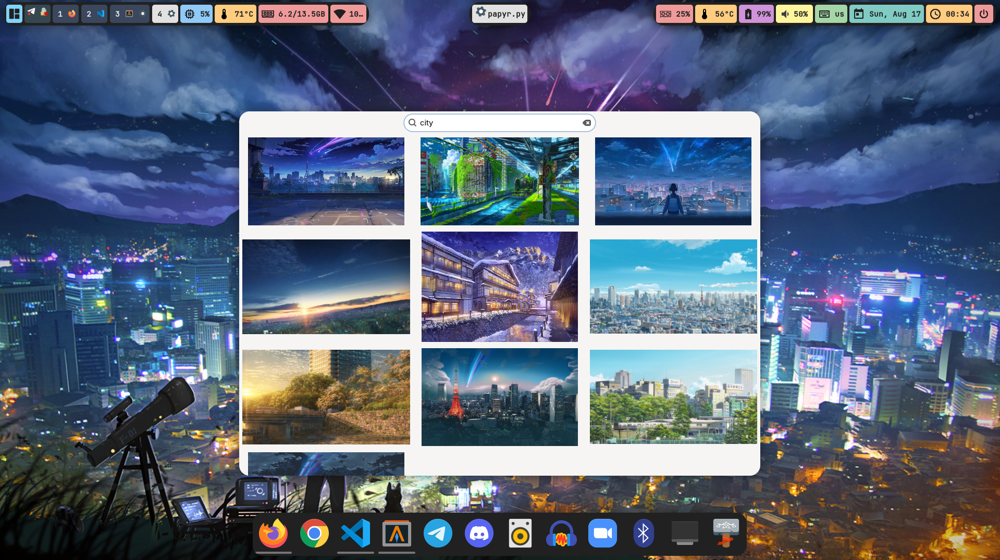

# Papyr
A fast, lightweight, and `rofi`-inspired wallpaper manager for Linux desktops. Papyr provides a visual, keyboard-driven interface to instantly select, set, and organize your wallpapers, with powerful features like a slideshow daemon and automatic terminal theming.

It is designed for users of tiling window managers (`awesome`, `i3`, `bspwm`, etc.) but now includes support for Wayland compositors and full desktop environments like GNOME.



## Features
- **Fluid Thumbnail Grid:** Displays a beautiful, gapless grid of wallpaper previews using `Gtk.FlowBox`.
- **Real-time Filtering:** Instantly filter wallpapers by filename using a `rofi`-style search bar.
- **Full-Screen Preview:** Press `Spacebar` on a selected image to view it in full-screen before setting.
- **Efficient Caching:** Thumbnails are generated once and cached in `~/.cache/papyr/`, ensuring near-instant startups.
- **Advanced Slideshow Daemon:** Run a background process to cycle through your wallpapers. Pause, resume, and skip tracks from the command line—perfect for binding to media keys.
- **Multi-Backend Support:** Works out-of-the-box on different environments by supporting `feh` (X11), `swaybg` (Wayland), and `gsettings` (GNOME/Cinnamon), with an automatic detection mode.
- **Ignore List:** Hide wallpapers from the main view without deleting the files (`Delete` key).
- **Customizable Order:** Organize your wallpapers with keyboard shortcuts (`Ctrl+J`/`K`) or drag-and-drop. The slideshow respects this order.
- **`pywal` Integration:** Automatically generate a new terminal color scheme from the selected wallpaper.
- **Full Keyboard Control:** Navigate with arrow keys, select with `Enter`, ignore with `Delete`, preview with `Spacebar`, reorder with `Ctrl+J`/`K`, and toggle the ignore view with `Ctrl+I`.
- **Customizable Theming:** The look and feel can be easily customized using a simple CSS stylesheet.

## Installation & Dependencies

Papyr is a Python application that uses GTK4.

#### 1. System Dependencies (Arch Linux)
Open a terminal and install the core dependencies using `pacman`:

```bash
sudo pacman -S python gtk4 python-gobject python-pip feh
```
- `feh` is used as a fallback setter. Other setters for your environment (like `swaybg` on Sway) may also be required.

#### 2. Python Dependencies
Install the required Python libraries using `pip`. `psutil` is used for safely managing the slideshow daemon.

```bash
pip install tomli Pillow psutil
```

#### 3. Get the Code
Clone this repository to your local machine:

```bash
git clone https://github.com/execorn/papyr.git
cd papyr
```

## Configuration

You must create a configuration file to tell Papyr where your wallpapers are located.

#### 1. Create the Config File

```bash
mkdir -p ~/.config/papyr
touch ~/.config/papyr/config.toml
```

#### 2. Edit the Config File
Paste the following into **`~/.config/papyr/config.toml`** and adjust it to your needs.

```toml
# A list of directories where Papyr should look for wallpapers.
# Use absolute paths or the ~ shortcut.
wallpaper_dirs = [
    "/home/execorn/wallpapers/imgs",
    "~/Pictures/Favorites"
]

[behavior]
# Set this to false if Papyr closes when you move the mouse away
# (common if your window manager uses "focus follows mouse").
# The value MUST be lowercase: true or false.
close_on_unfocus = false

[slideshow]
# The time between wallpaper changes, in minutes.
interval = 10

[features]
# Set to true to automatically run 'wal' after setting a new wallpaper.
# Requires 'wal' (pywal) to be in your PATH.
enable_pywal = true

# NEW: Choose your wallpaper setting backend.
[setter]
# Options: "auto", "feh", "swaybg", "gnome".
# "auto" is recommended. It will try to detect your environment.
command = "auto"
```
Upon first use, Papyr will also create an `ignore.list` and `order.list` in this directory to persist your settings.

## Usage

#### Running the GUI
To select a wallpaper, simply run the main script. It's recommended to bind this command to a hotkey in your window manager.

```bash
python3 /path/to/papyr/papyr.py
```

#### Controlling the Slideshow
The slideshow is controlled via command-line arguments.

```bash
# Start the background daemon
python3 papyr.py --slideshow start

# Stop the background daemon
python3 papyr.py --slideshow stop

# Pause or resume the slideshow timer
python3 papyr.py --slideshow pause
python3 papyr.py --slideshow resume

# Immediately skip to the next or previous wallpaper
python3 papyr.py --slideshow next
python3 papyr.py --slideshow prev
```
The daemon will automatically use your latest settings. If you change the order while the daemon is running, you must restart it to see the new order take effect.

#### In-App Hotkeys
- **`Enter` / `Double-Click`**: Set selected wallpaper and close.
- **`Spacebar`**: Show a full-screen preview of the selected wallpaper.
- **`Esc`**: Close without setting.
- **`Arrow Keys`**: Navigate the grid.
- **`Delete`**: Move the selected wallpaper to the ignore list.
- **`Ctrl+I`**: Toggle between the main view and the ignored wallpapers view.
- **`Ctrl+J` / `Ctrl+K`**: Move the selected wallpaper down or up in the order.

## Development Journey & Problems Encountered
This project was a significant learning experience, particularly when working with the modern GTK4 toolkit. Several features turned out to be far more complex than anticipated. Documenting these challenges is important for transparency and for any future developers.

*   **GTK4 API Versioning:** The most significant hurdle was the rapid evolution of the GTK4 API. Many methods that were present in early versions or in online tutorials (`set_reorderable`, `get_children`) were deprecated or removed. This led to numerous `AttributeError` crashes and required multiple rewrites of core UI components to use more fundamental and stable APIs.

*   **Drag-and-Drop Implementation:** This feature was rebuilt from scratch five times. The final, working implementation uses a much simpler `GestureDrag`, which proved to be more direct and reliable, although it does not provide the "move out of the way" animation. This was a compromise for the sake of stability and correctness.

*   **Configuration Parsing:** A subtle bug where the `close_on_unfocus` setting was always `True` was traced back to a TOML specification detail: boolean values must be lowercase (`true`/`false`), not capitalized as they are in Python.

*   **Concurrency:** Early versions suffered from a race condition where the UI thread would try to load a thumbnail before the background thread had finished writing it, causing `GdkPixbuf` errors. This was solved by making the file creation atomic (writing to a `.tmp` file and then renaming it).

## Future Development (TODO)
- [ ] **Animated Drag-and-Drop:** Revisit the `DragSource`/`DropTarget` APIs to correctly implement the "move out of the way" animation, which was sacrificed for stability.
- [ ] **More Setters:** Add support for other wallpaper utilities like `hyprpaper`, `wbg` (for Wayland) and `xfconf-query` (for XFCE).
- [ ] **Multi-Monitor Support:** Allow setting different wallpapers for each monitor via the right-click menu.
- [ ] **Online Sources:** Add the ability to pull wallpapers from sources like Unsplash or wallhaven.cc.
- [ ] **Packaging:** Create a `setup.py` for easier installation via `pip` and potentially a `PKGBuild` for Arch Linux users.

## License
This project is licensed under the MIT License. See the `LICENSE` file for details.